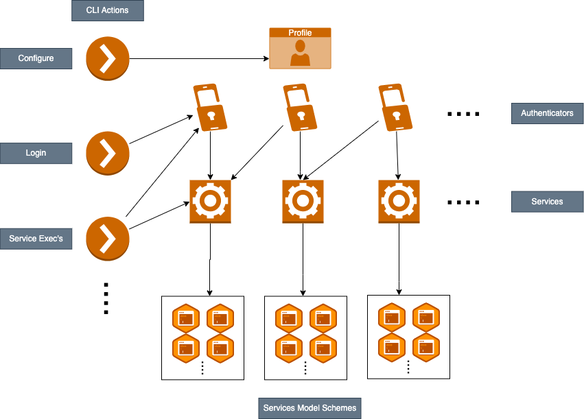

# Architecture

The library is designed as follows:

{: style="height:100%;width:100%"}

Design Perspectives
-------------------
The main components are:

- <b>Profile</b>: The profile defines a set of properties and information about the user's authentication methods. Profiles are persisted on the filesystem for subsequent actions.
- <b>Authenticators</b>: The integrations with specific authentication methods, which enable interaction with services. An authentication method can either be Identity (User/Service User) or a custom implementation.
- <b>Services</b>: The service providing functionality (requires one or more associated authenticators to perform actions). For example, the SIA service exposes SIA APIs in an secure manner.
- <b>Services Model Schemes</b> The models exposed by a service, which can be used to perform the service's actions.
- <b>CLI Actions</b>: CLI interface built on the SDK, which provides users with the following shell commands:
    - `configure`: Configure a profile with authentication details
    - `login`: Log in with a configured profile authenticator
    - `exec`: Execute services actions

Enable Attribute
----------------

The Enable attribute controls what services and actions are available in the Terrafrom/CLI. It allows developers to hide work-in-progress features from releases.

### Control Levels

| Level | Scope | Effect |
|-------|-------|--------|
| Service | Entire service | Service is not registered |
| Action | Single action | Action is filtered out |

### How It Works

 1. The Enable attribute is checked at registration time (during `init()`)
 2. Filtering is controlled by a build flag (`releasedFeaturesOnly`)
 3. When filtering is active, disabled services are skipped and disabled actions are removed
 4. The rest of the SDK sees only enabled services and actions

### Build Flag

By default, filtering is OFF. Enable it for release builds:

```bash
go build -ldflags "-X github.com/cyberark/idsec-sdk-golang/pkg/services.releasedFeaturesOnly=true" ./...
```

### Default Behavior

**Warning:** If `Enabled` is not set, the service or action is enabled. This keeps existing code working without changes.

For usage examples, see [Services](./sdk/services.md#enable-attribute).
