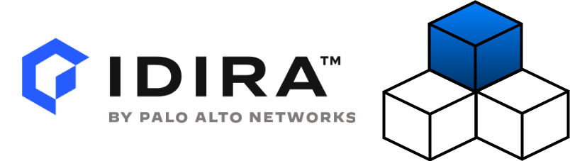

# Idsec SDK

{: style="height:80%;width:70%"}

The official Golang SDK for CyberArk's Identity Security Platform Services.

## Motivation

Idsec SDK is an API-first library used to automate different sets of operations in order to ease day to day development. The SDK provides a Golang library for code integration with Identity Security Platform services.

For CLI usage and automation, see the [Idsec CLI](https://github.com/cyberark/idsec-cli-golang) documentation.

For managing infrastructure with Terraform, see the [Idsec Terraform Provider](https://github.com/cyberark/idsec-terraform-provider) repository.

## License

This project is licensed under Apache License 2.0 - see [License](license.md) for more details.

Copyright (c) 2025 CyberArk Software Ltd. All rights reserved.
